# STM32的IAP技术

## 基于CAN总线的STM32F103 BootLoader设计


## 1 不同的程序下载方式                                                                                                                                                                                                                                                                                                                                                                                                                                                                                                                                                                                                                                                                                                                                                                                                                                                                                                                                                                                                                                                                                                                                                                                                                                                                                                                                                                                                                                                                                           

目前，单片机的程序烧录方式可以分为三种：ICP，ISP，IAP。

### 1.1 **ICP**：In-Circuit Programming

在电路中编程。使用厂家配套的软件或仿真器进行程序烧录，目前主流的有JTAG接口和SWD接口，常用的烧录工具为J-Link、ST-Link等。

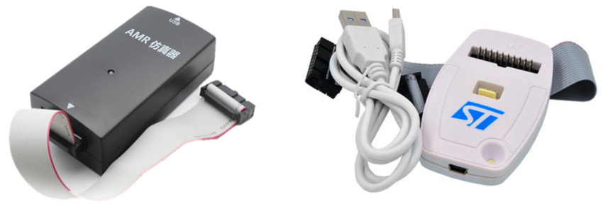

在程序开发阶段，通常在连接下载器的情况下直接使用编程软件进行程序下载调试。

在MDK软件中可以选择不同的下载器。

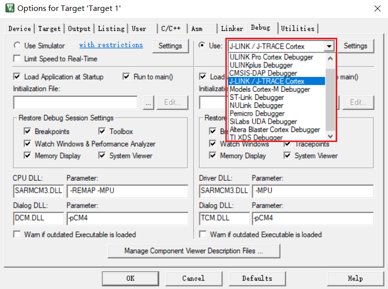

### 1.2 **ISP**：In-System Programing

在系统中编程。以STM32为例，其内置了一段Bootloader程序，可以通过更改BOOT引脚电平来运行这段程序，再通过ISP编程工具将程序下载进去。下载完毕之后，再更改BOOT至正常状态，使得MCU运行所下载的程序。

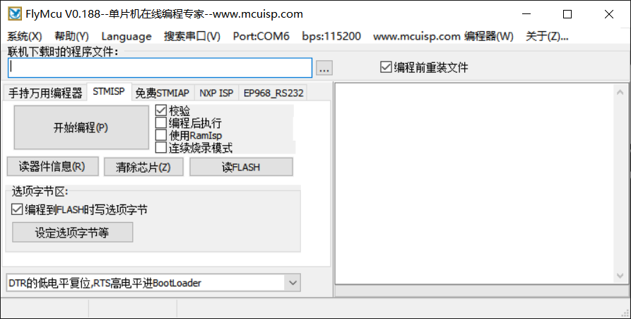

正点原子的STM32开发板中专门设计了一个单片机自动复位及设置Boot引脚电平状态的电路，便于程序下载。

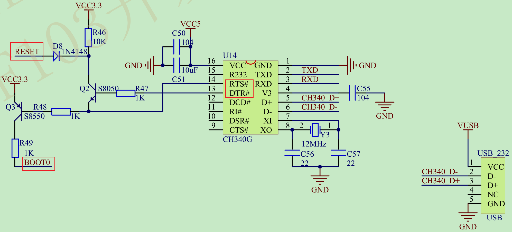

### 1.3 **IAP：**In-Application  Programming

在应用中编程。IAP可以使用微控制器支持的任一种通信接口（如I/O端口、USB、CAN、UART、I2C、SPI等）下载程序或数据到FLASH中。IAP允许用户在程序运行时重新烧写FLASH中的内容。但需要注意，IAP要求至少有一部分程序（Bootloader）已经使用ICP或ISP烧到FLASH中。

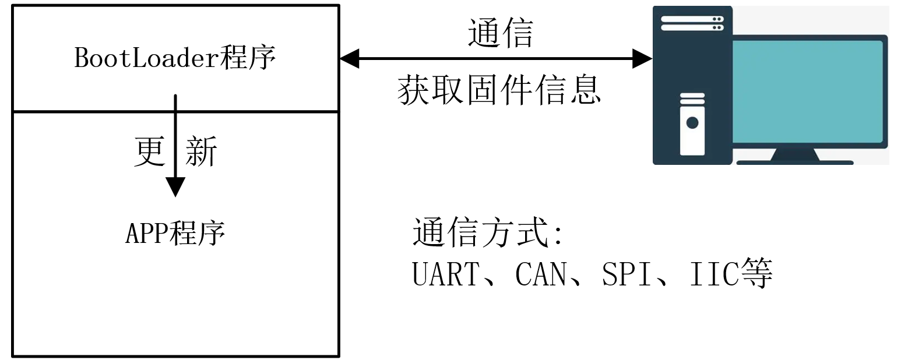

无论是ICP技术还是ISP技术，都需要连接下载线，设置跳线帽等操作。一般来说，产品的电路板都会密封在外壳中，在这时若要使用ICP或ISP的方式对程序进行更新，则必然要拆装外壳，如果产品的数量比较多，将花费很多不必要的时间。

采用IAP编程技术，可以在一定程度上避免上述的情况。一般情况下，产品的外壳都会留有通信接口，若能通过这种通信方式对程序进行升级，则可以省去拆装的麻烦。在此基础上，若引入远距离或无线数据传输方案，更可以实现远程编程或无线编程。

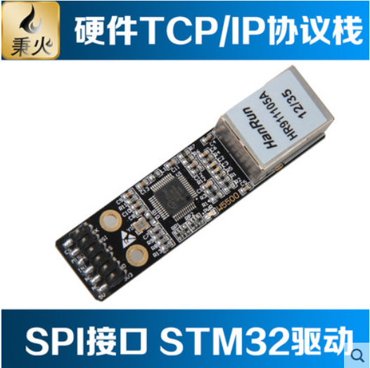

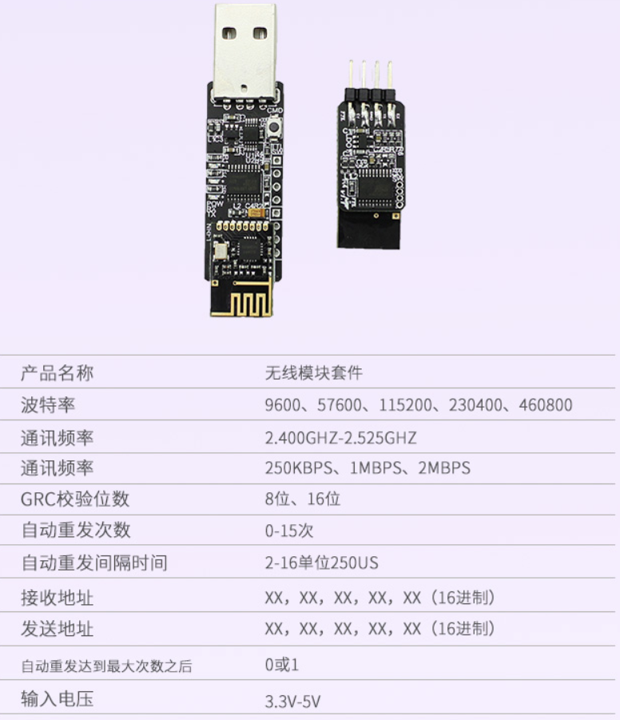

**某种微控制器支持IAP技术的首要前提是其必须是基于可重复编程闪存的微控制器。**

STM32微控制器带有可编程的内置闪存，同时STM32拥有在数量上和种类上都非常丰富的外设通信接口，因此在STM32上实现IAP技术是**完全可行**的。 

## 2 IAP方案设计

### 2.1 IAP简介

IAP技术的核心在于BootLoader程序的设计，这段程序预先烧录在单片机中，正常的APP程序可以使用BootLoader程序中的IAP功能写入，也可以两部分代码一起写入，以后需要程序更新时通过IAP进行代码更新。每次板卡上电都会首先执行BootLoader程序，在程序内判断进行固件升级还是跳转到正常的APP程序。

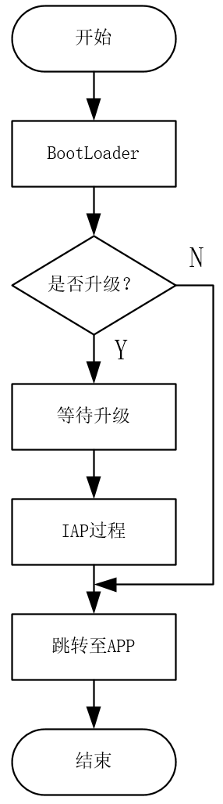

是否进行固件升级的判断可以从硬件和软件两个方面进行考虑。

1. 硬件实现：通过拨码开关、跳线帽等方式设定单片机某一引脚电平状态，程序通过读取引脚电平判断是否需要升级。此种方式需要接触板卡进行操作，当板卡被封闭在外壳中或安装于不便于操作位置时很难实现。
2. 软件实现-1：软件内设定一标志位（变量），通过判断标志位状态判断是否需要升级。该标志位状态掉电不能改变，故需要存储在外部EEPROM或单片机内部FLASH中。若存储在外部EEPROM，则需要增加额外的电路；若存储在单片机内部FLASH，由于FLASH每次写入都需要擦除一整页，会造成资源浪费。
3. 软件实现-2：单片机每次上电首先进入BootLoader程序，在BootLoader中等待一定时间，若上位机软件在该时间段内发起通讯，则停留在BootLoader程序中等待固件升级；若该时间段内无通讯，则跳转到正常的APP程序。该方式每次上电都要等待一定时间，需要考虑是否可以接收。
3. ……

在IAP过程中，单片机通过特定的通讯方式从上位机软件接收程序数据，并执行FLASH擦写操作对APP部分的程序进行更新。

IAP过程中传输的数据文件一般为后缀名为bin的文件，该文件内容与正常烧录进FLASH中的数据内容一致，便于程序升级。但是MDK软件并不能直接生成bin文件，需要进行一些配置。

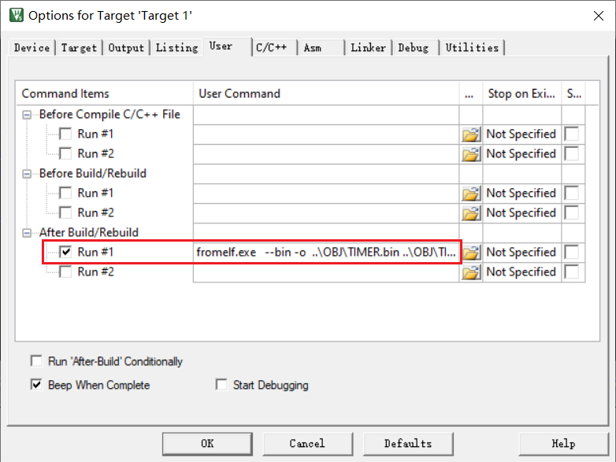

```
fromelf.exe  --bin -o ..\OBJ\TIMER.bin ..\OBJ\TIMER.axf  //“TIMER”需要改成自己程序的名字
```

由于我把fromelf.exe所在目录添加到了环境变量，所以可以直接这样写。如未添加环境变量，则需要写清楚详细路径，该文件一般在MDK软件的安装目录下。

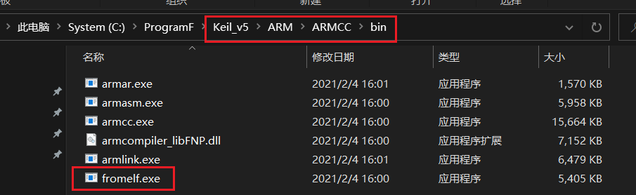

配置完成重新编译之后即可生成bin文件（OBJ目录）。

### 2.2 FLASH空间划分

BootLoader程序和APP 程序存放在 STM32 FLASH 的不同地址范围，一般从最低地址区开始存放 BootLoader，紧跟其后的就是 APP 程序。在FLASH足够大的情况下，还可以分配多个APP程序区域，便于恢复默认程序或者执行多段功能不同的程序。

#### 2.2.1 不同型号STM32 FLASH大小

在进行FLASH空间划分之前，首先需要了解一下不同型号STM32单片机的FLASH大小。

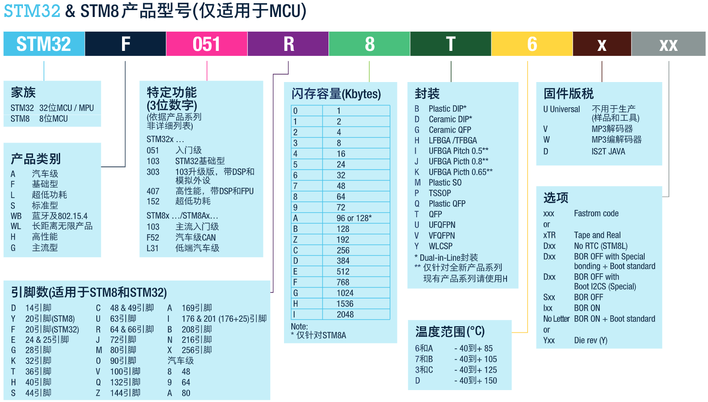

对于不同容量的STM32F1系列产品，其FLASH页大小是不同的，具体的容量划分规则如下：

- **小容量产品**：FLASH容量在16K至32K字节之间的STM32F101xx、STM32F102xx和STM32F103xx微控制器。
- **中容量产品**：FLASH容量在64K至128K字节之间的STM32F101xx、STM32F102xx和STM32F103xx微控制器。
- **大容量产品**：FLASH容量在256K至512K字 节之间的STM32F101xx和STM32F103xx微控制器。

对于小容量和中容量的产品，其页大小为1K，对于大容量产品，其页大小为2K。

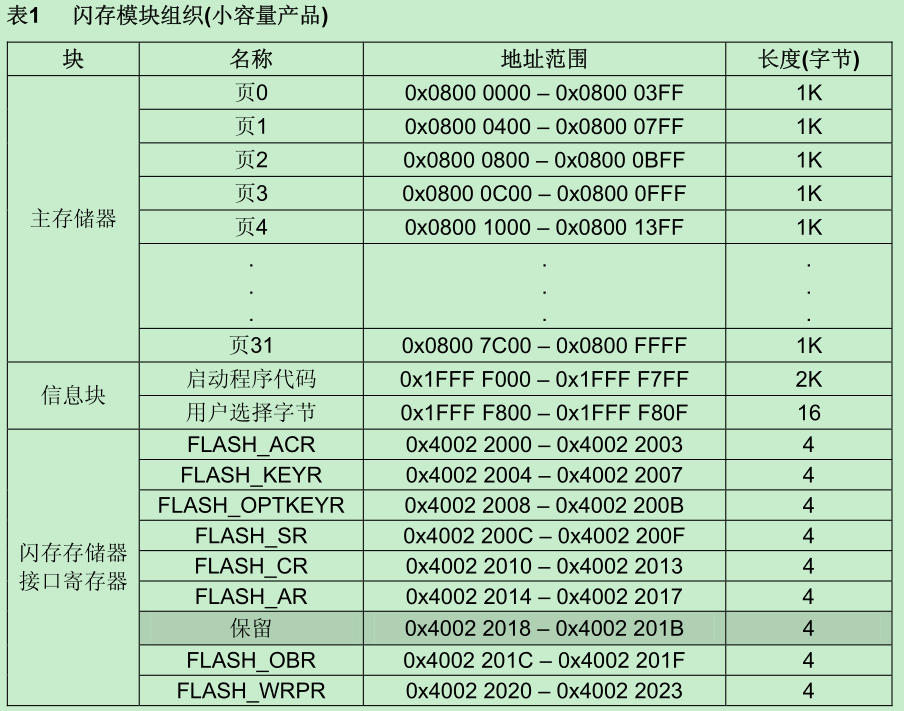

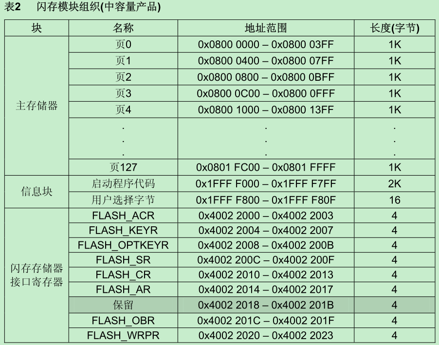

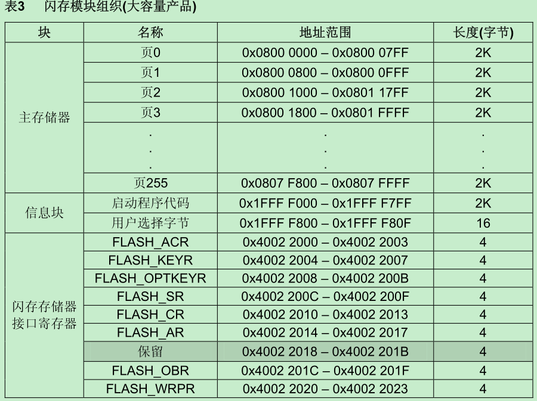

#### 2.2.2 查看程序占用空间大小

在进行FLASH空间划分时，必须知道编写的程序占用FLASH空间大小。用MDK软件进行工程编译之后会生成一个.map文件，在该文件末尾可找到程序需要占用的FLASH空间。

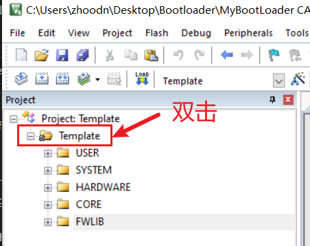

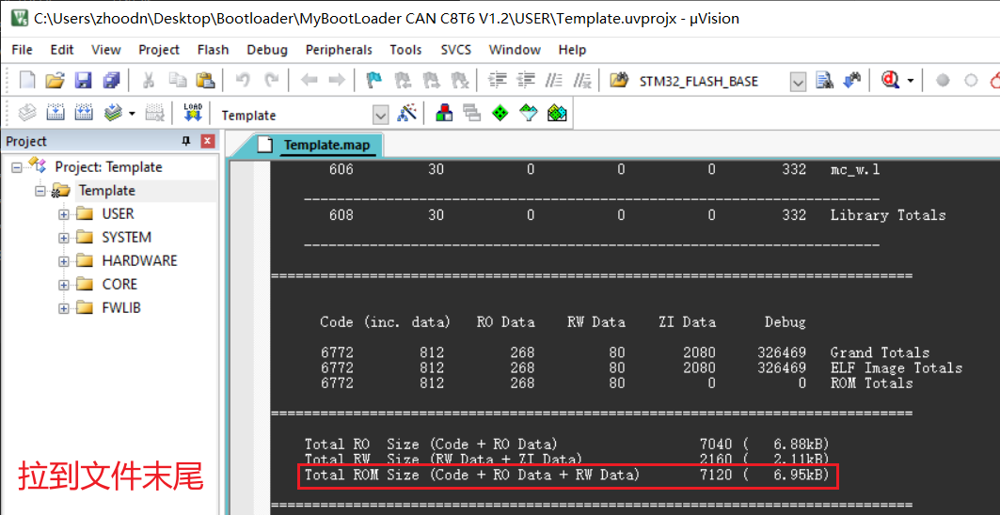

在实际设计过程中，主要是确定BootLoader程序占用空间，便于确定APP程序的起始地址。

在这时候可以先编写部分BootLoader程序，再通过map文件查看当前占用空间，从而预估BootLoader程序最终会占用的空间大小。

在实际空间分配过程中，可以稍微大一点，以便于后续对BootLoader的功能扩展。

> 如果对MDK的编译过程以及文件类型感兴趣，可以阅读《[野火EmbedFire]《STM32库开发实战指南——基于野火霸道开发板》—20211109》第46章的内容。
>
> 视频链接：https://www.bilibili.com/video/BV1Ss411M75x?spm_id_from=333.999.0.0

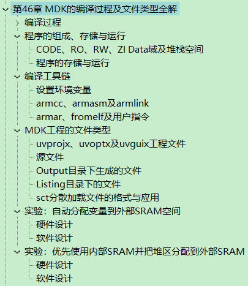

在MDK软件配置项中，可以对程序的起始位置以及大小进行设置。

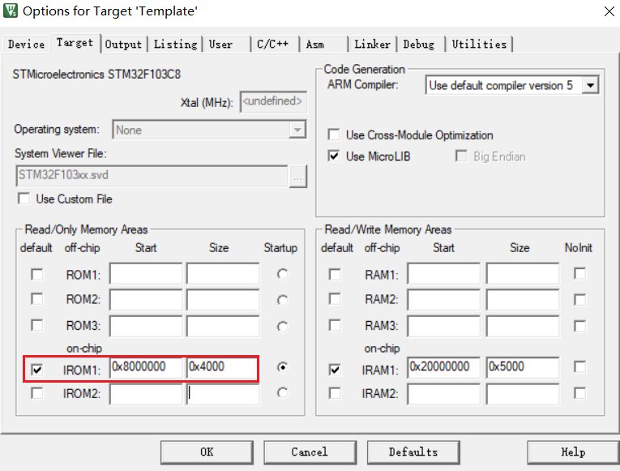

对于BootLoader程序来说，只需要设置其Size，该值可根据刚才map文件中的值进行预估。

#### 2.2.3 APP程序中需要做的配置项

BootLoader程序按照正常的程序编写即可。而APP程序由于其下载位置与默认程序下载位置不同，故需要做一些特殊的配置。

首先是APP 程序起始地址设置

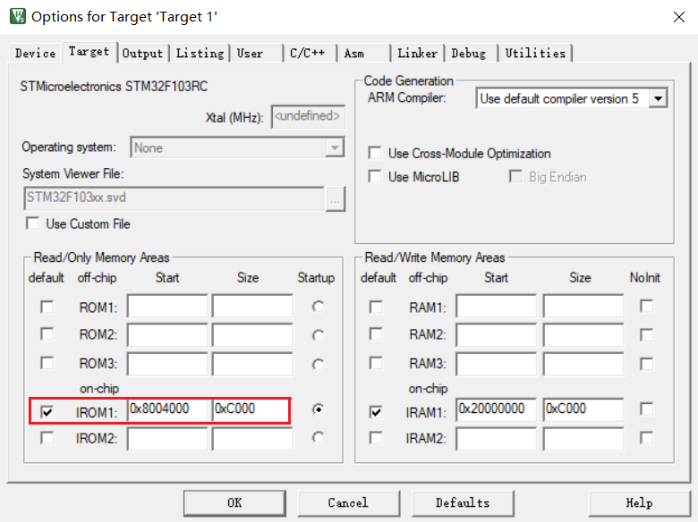

起始位置即去除BootLoader程序之后剩余空间的首地址。一般设定为某一页的首地址，因为FLASH写入之前必须进行页擦除。

Size = FLASH原始大小 - 偏移量（0x4000），我使用的是STM32F103C8T6，FLASH大小为64K。

接着设置中断向量表的偏移量，在主函数起始位置添加：

```c
SCB->VTOR = FLASH_BASE | 0x4000; //0x4000即BootLoader大小（偏移量）
```

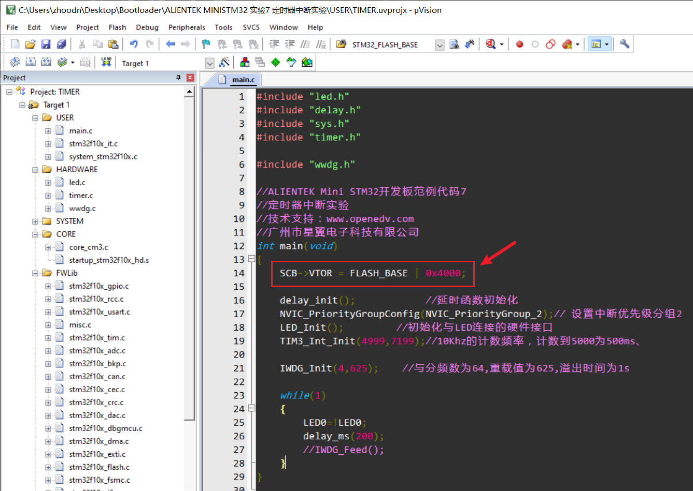

## 2.3 IAP程序设计 

### 2.3.1 IAP（BootLoader）编程关键技术

1. 通信
2. Flash擦写
3. APP跳转


##### 通信需要考虑的问题

1. 选用何种通信方式：串口、CAN、以太网......
2. 通信协议：数据分发、帧头帧尾校验
3. 配套上位机


##### Flash写入流程

1 解锁

```c
void FLASH_Unlock(void)				//解锁
```

2 擦除

```c
//页擦除
FLASH_Status FLASH_ErasePage(uint32_t Page_Address);

//整片擦除
FLASH_Status FLASH_EraseAllPages(void);
```

3 写入

```c
//半字写入
FLASH_Status FLASH_ProgramHalfWord(uint32_t Address, uint16_t Data);

//全字写入
FLASH_Status FLASH_ProgramWord(uint32_t Address, uint32_t Data);
```

4 上锁

```C
void FLASH_Lock(void);
```


接收多少数据写入一次？

> FLASH写入之前必须进行页擦除
>
> STM32F103 FLASH 页大小：1k 或 2k
>
> 接收满1页大小的数据写入一次


##### APP跳转

正点原子串口IAP实验IAP跳转代码

```c
void iap_load_app(u32 appxaddr)
{
	if(((*(vu32*)appxaddr)&0x2FFE0000)==0x20000000)	//检查栈顶地址是否合法.
	{ 
		jump2app=(iapfun)*(vu32*)(appxaddr+4);		//用户代码区第二个字为程序开始地址(复位地址)		
		MSR_MSP(*(vu32*)appxaddr);					//初始化APP堆栈指针(用户代码区的第一个字用于存放栈顶地址)
		jump2app();									//跳转到APP.
	}
}
```

参考安富莱代码之后更改的IAP跳转代码

```c
void iap_load_app(u32 appxaddr)
{
    int i = 0;
    
	if(((*(vu32*)appxaddr)&0x2FFE0000)==0x20000000)	//检查栈顶地址是否合法.
	{ 
        /* 首地址是MSP，地址+4是复位中断服务程序地址 */
		jump2app=(iapfun)*(vu32*)(appxaddr+4);
            
         /* 关闭全局中断 */
        __set_PRIMASK(1); 
                 
        /* 关闭滴答定时器，复位到默认值 */
        SysTick->CTRL = 0;
        SysTick->LOAD = 0;
        SysTick->VAL = 0;
        
        /* 设置所有时钟到默认状态 */
        RCC_DeInit();
        
        /* 关闭所有中断，清除所有中断挂起标志 */  
        for (i = 0; i < 8; i++)
        {
            NVIC->ICER[i]=0xFFFFFFFF;
            NVIC->ICPR[i]=0xFFFFFFFF;
        }
        
        /* 使能全局中断 */ 
        __set_PRIMASK(0);
        
        /* 在RTOS工程，这条语句很重要，设置为特权级模式，使用MSP指针 */
        __set_CONTROL(0);
        
        MSR_MSP(*(vu32*)appxaddr);					//初始化APP堆栈指针(用户代码区的第一个字用于存放栈顶地址)
		jump2app();									//跳转到APP.
        
        /* 跳转成功的话，不会执行到这里，用户可以在这里添加代码 */
        while (1)
        {

        }
	}
}		
```

### 2.3.2 IAP编程实战

需要准备的设备及材料

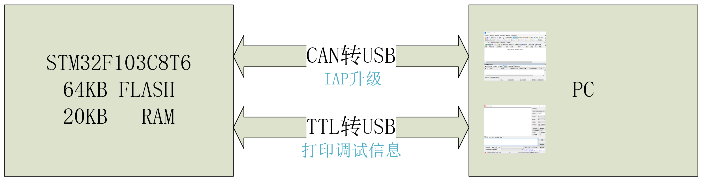


USB-CAN适配器


https://item.taobao.com/item.htm?spm=a1z10.1-c-s.w5003-22815269889.2.43d17a62SzFCrG&id=15148465486&scene=taobao_shop


USB转TTL CH340模块

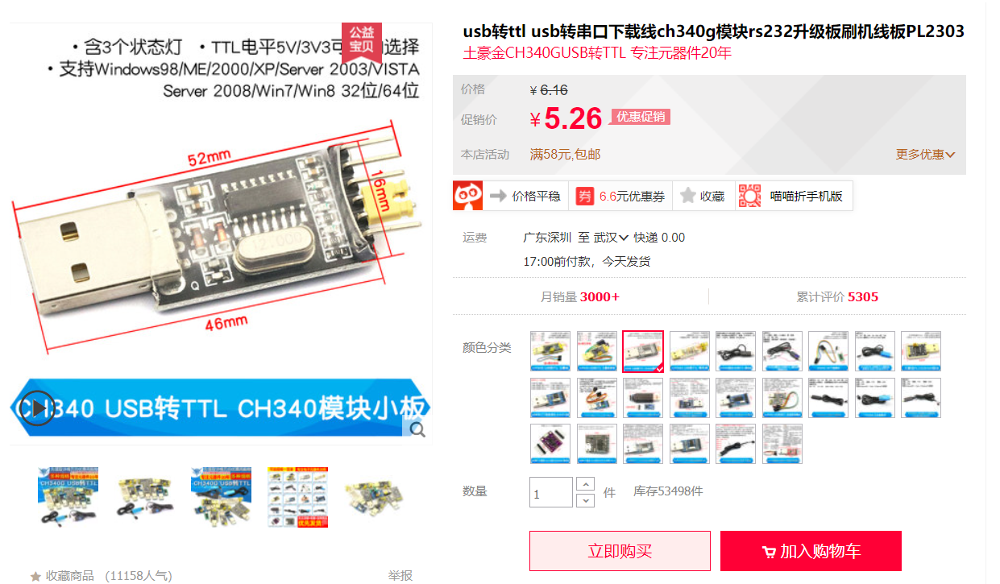

https://detail.tmall.com/item.htm?spm=a230r.1.14.47.29c45370i9NVFF&id=41323941056&ns=1&abbucket=1&skuId=3944185979947


周立功CANPro调试软件（可直接发送bin文件）

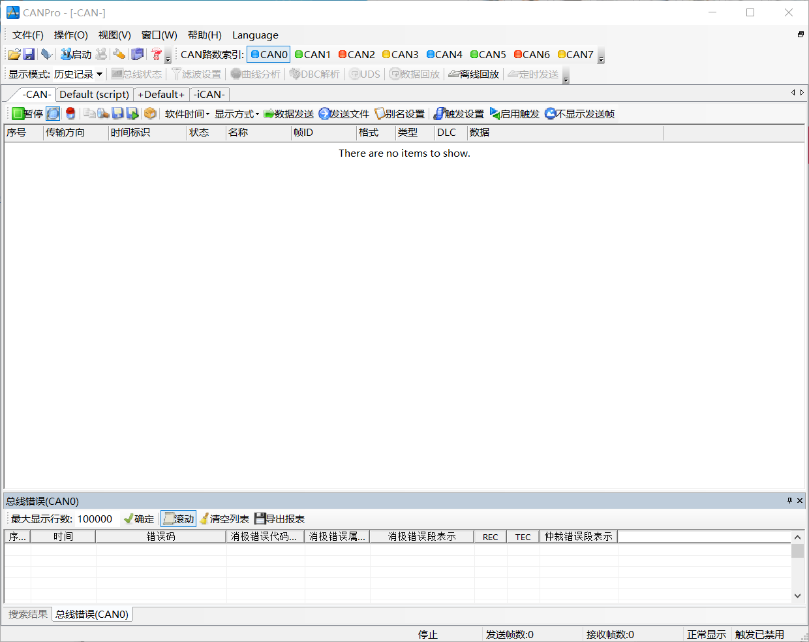

https://www.zlg.cn/index.php/can/down/down/id/42.html


创芯科技原厂调试软件

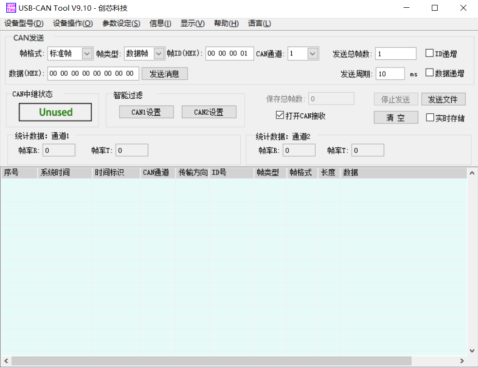


串口调试助手

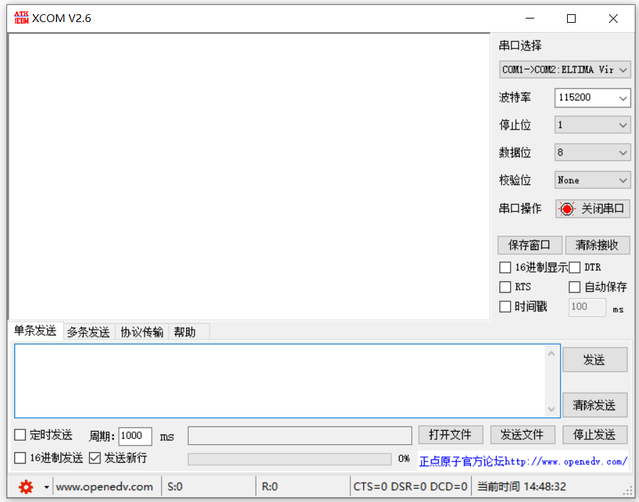


**参照正点原子的串口IAP实验例程编写基于CAN总线的BootLoader程序**

相较于原子的IAP例程，主要做以下几点工作：

1. 原子例程所使用的芯片为STM32F103ZET6，更改目标芯片为STM32F103C8T6，并修改FLASH容量宏定义以及重新划分FLASH空间；
2. 添加CAN底层驱动代码至工程；
3. 逻辑代码修改。

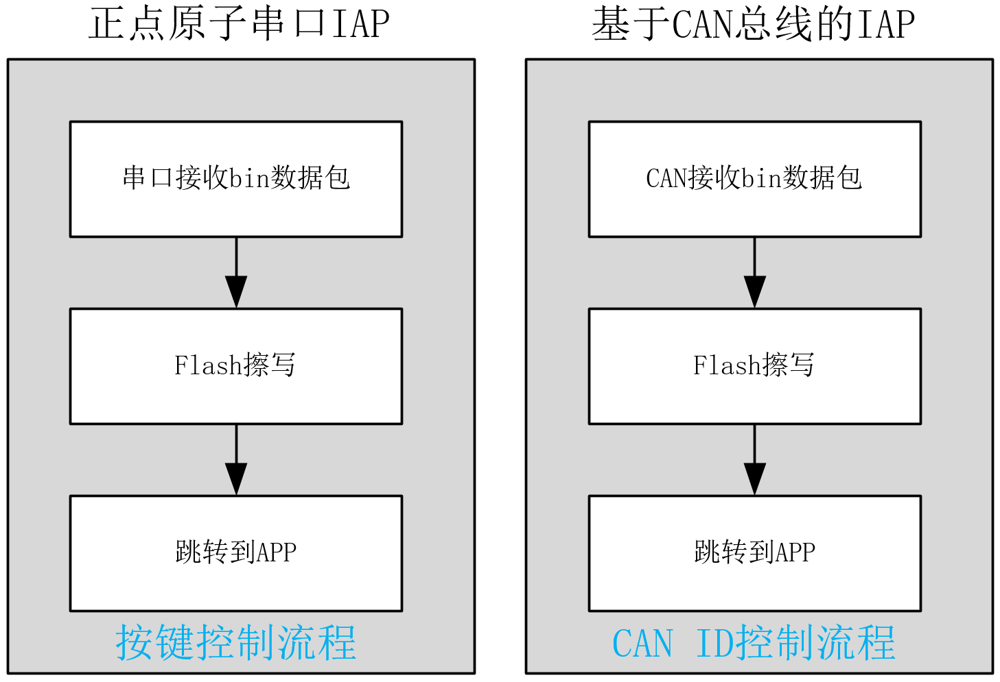

### 2.3.3 代码解析


## 2.5 IAP实验验证


## 2.6 不足与展望

目前数据为一次性整包传输，接收到的数据存储在数组里，占用单片机RAM空间，而单片机的RAM是有限的。

以STM32F103C8T6为例，RAM大小仅为20KB。若APP程序所需大于这个值，则此方法不能使用。

另，直接传输数据包的方式可靠性低，如果数据传输过程中出错无法判断。

为解决上述问题，需考虑将**数据分包传输，并增加数据校验**。


目前使用调试助手的方式仅能实现整个文件自动传输，若要采用数据分包+校验的方式，需定制开发上位机软件。


单片机与上位机需制定一套稳定可靠的通信协议。


